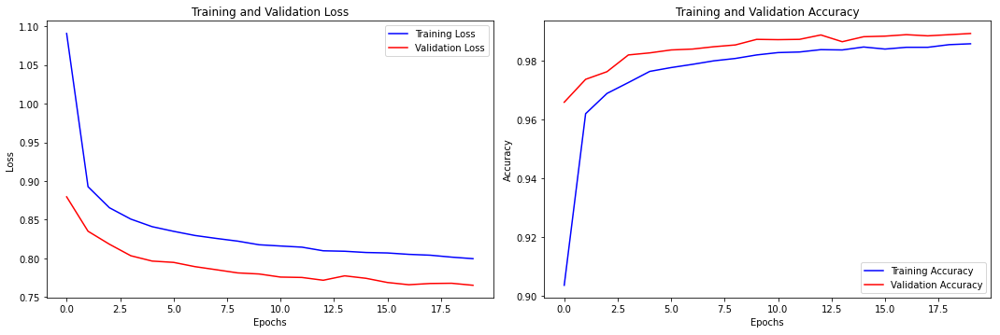
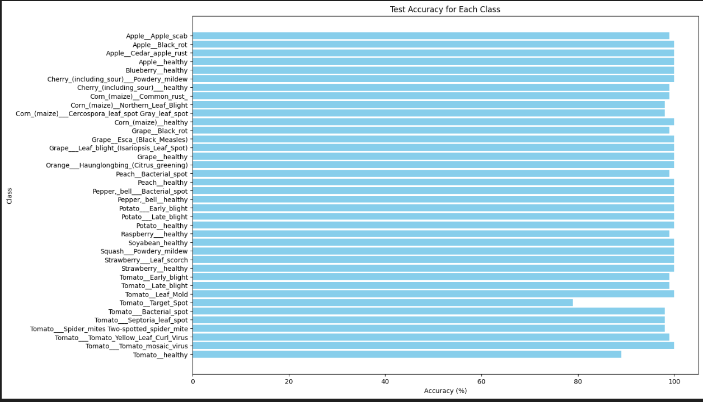

# Plant Disease Classification using Swin Transformer

This project implements a deep learning model for classifying plant diseases from leaf images. The model is built using the Swin Transformer architecture and is trained on a dataset containing images of various plant diseases. The goal is to accurately classify the type of disease present in the input image.

## Table of Contents

- [Introduction](#introduction)
- [Dataset](#dataset)
- [Model Architecture](#model-architecture)
- [Training](#training)
- [Evaluation](#evaluation)
- [Results](#results)
- [Installation](#installation)
- [Contributing](#contributing)
- [License](#license)

## Introduction

Plant diseases can significantly impact agricultural productivity. Early and accurate detection of these diseases is crucial for effective management. This project leverages the Swin Transformer, a state-of-the-art deep learning model, to classify plant diseases from leaf images with high accuracy.

## Dataset

The dataset used in this project consists of images of healthy and diseased plant leaves. It includes 38 classes, each representing a specific disease or a healthy leaf. The images are preprocessed and augmented before being fed into the model.

## Model Architecture

The model is based on the Swin Transformer architecture, which has been shown to perform well on various computer vision tasks. The Swin Transformer operates by shifting windows across an image and processing patches in a hierarchical manner, enabling the model to capture both local and global features.

## Training

The model is trained using PyTorch with the following configuration:
- **Optimizer:** Adam
- **Learning Rate:** 0.001
- **Loss Function:** Cross-Entropy Loss
- **Number of Epochs:** 20 (can be adjusted based on the dataset size)
- **Batch Size:** 32

Data augmentation techniques such as random rotations, flips, and scaling are applied to improve the model's generalization.

## Evaluation

The model is evaluated on a separate test set. The evaluation metrics include:
- **Test Loss**
- **Test Accuracy** (per class and overall)

## Results
Test Accuracy of 98% (9744/9856)



## Installation

To run this project locally, follow these steps:

1. Clone the repository:
    ```bash
    git clone https://github.com/yourusername/plant-disease-classification.git
    ```
2. Navigate to the project directory:
    ```bash
    cd plant-disease-classification
    ```
3. Create a virtual environment and activate it:
    ```bash
    python3 -m venv venv
    source venv/bin/activate  # On Windows use `venv\Scripts\activate`
    ```
4. Install the required packages:
    ```bash
    pip install -r requirements.txt
    ```

## Contributing

Contributions are welcome! Please submit a pull request or open an issue for any feature requests, bug fixes, or improvements.

## License

This project is licensed under the MIT License - see the [LICENSE](LICENSE) file for details.
